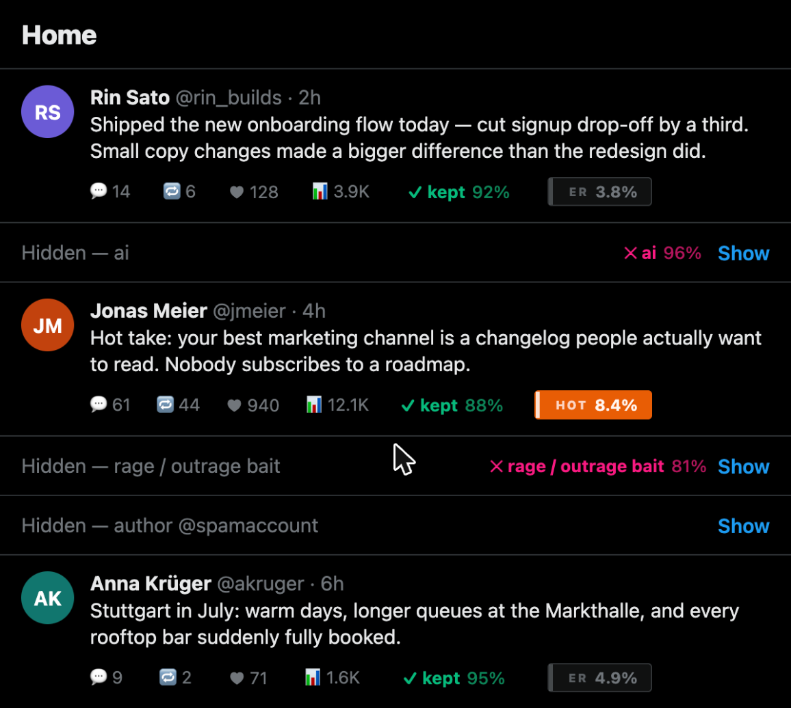
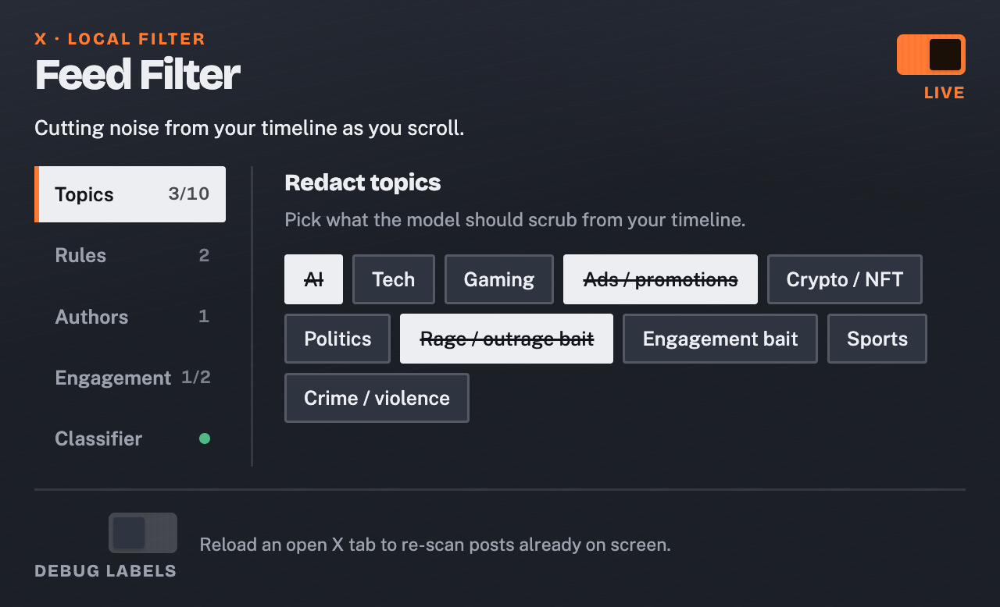
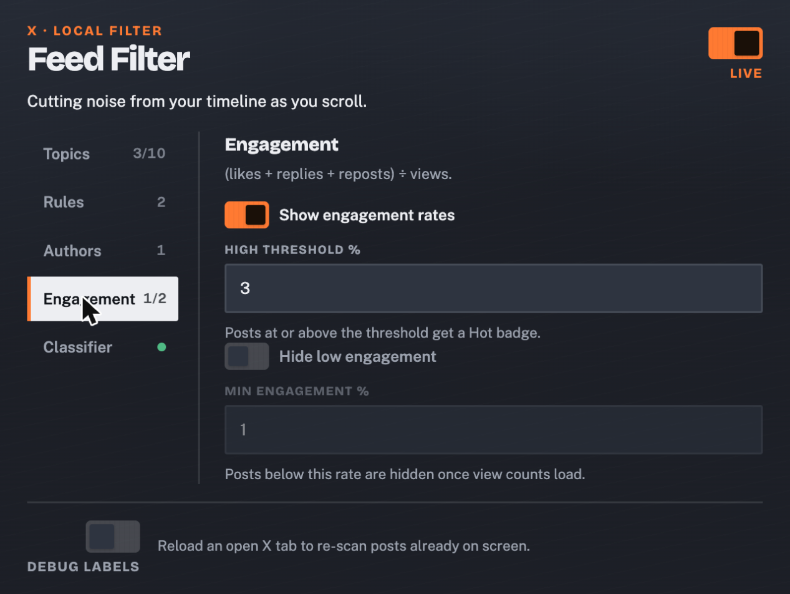
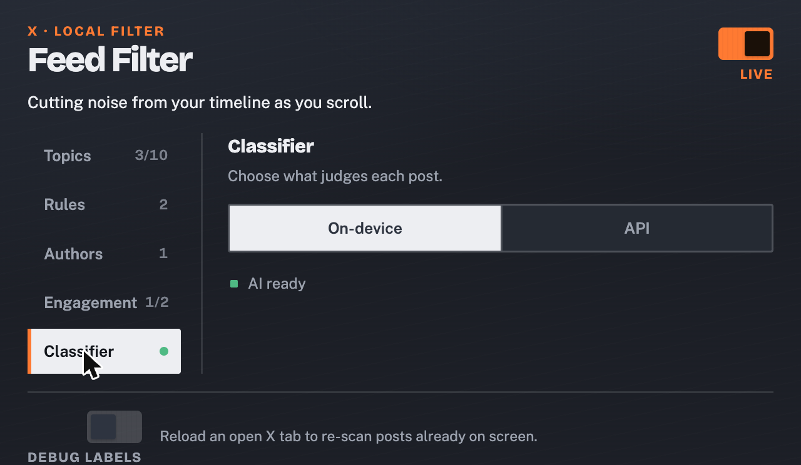

# Feed Filter — an on-device AI feed filter for X

**Built at the Cursor Hackathon, Stuttgart — July 2026**

Feed Filter is a Chrome extension that overrides X's ranking algorithm with your own rules: it reads the timeline as it renders and hides everything you don't want — ragebait, ads, engagement bait, whole topics, specific accounts — so the feed only shows what's relevant to you. The LLM judging each post runs **entirely on your device**, with zero servers, zero API costs, and zero data leaving the browser. Point it at an OpenAI-compatible endpoint instead if you want a stronger model.



## Table of contents

- [Why](#why)
- [Features](#features)
- [How it works](#how-it-works)
- [Getting started](#getting-started)
- [Using it](#using-it)
- [Tech stack](#tech-stack)
- [Limitations & roadmap](#limitations--roadmap)

## Why

X's algorithm decides what you see, not you — and it optimizes for engagement, not for your time. If you create content, you can't just log off either: X is a research tool, a distribution channel, and a networking tool all at once. So you scroll past outrage bait, crypto shills, engagement-farming threads, and ads dressed up as posts to get to the handful of posts that actually matter.

"Mute this word" is keyword-matching and misses anything phrased differently. Server-side moderation hands your feed to a third-party API. Feed Filter takes the ranking decision back from the algorithm and gives it to you: say, in plain language, *"hide AI hype threads"* or *"hide anything that's obviously an ad,"* and a language model re-judges every post against your rules as the timeline renders — locally, on-device, with nothing sent anywhere. You define the feed; the algorithm just supplies the raw posts.

## Features

- 🎯 **Topic & rule filters** — 10 one-click presets (AI, Crypto, Ragebait, Ads, …) plus unlimited plain-language custom rules
- 🚫 **Author blocking** — block a handle once, gone forever, no LLM needed
- 📊 **Engagement badges** — likes+replies+reposts ÷ views, with a **Hot** badge and an optional low-ER auto-hide
- 🧵 **Thread-aware hiding** — hide one post, the whole thread (and late-arriving replies) goes with it
- 🔌 **On-device or API** — Chrome's built-in Gemini Nano by default, or swap in any OpenAI-compatible endpoint
- 🐛 **Debug mode** — live per-post verdict badges with confidence % and full model reasoning on hover
- 🛡️ **Fail-open** — any classifier error just leaves the post visible, never silently over-hides
- 🎛️ **Tabbed popup** — Topics / Rules / Authors / Engagement / Classifier, with live status badges

| Topics | Engagement | Classifier |
|---|---|---|
|  |  |  |

## How it works

```
entrypoints/x.content.ts   → runs on x.com / twitter.com, boots the engine
lib/engine.ts               → platform-agnostic scan/classify/cache loop
lib/adapters/x.ts            → all X-specific DOM knowledge (selectors, collapse UI)
entrypoints/background.ts   → owns the classifier queue (serialized on-device,
                               concurrency-capped for API mode)
lib/classifier/
  ├─ onDevice.ts             → Chrome Prompt API (Gemini Nano), persistent session
  ├─ openai.ts                → any OpenAI-compatible /chat/completions endpoint
  └─ parse.ts                 → shared JSON verdict parsing, fail-open on any error
lib/prompt.ts                → one system prompt + batch schema for both providers
entrypoints/popup/            → React settings UI, WXT + Vite
```

A `MutationObserver` on `document.body` re-scans on every DOM change. For each post: check the author blocklist and the low-engagement floor locally (no LLM), check the in-memory verdict cache keyed by the post's stable status-link id (not the DOM node — X recycles nodes as you scroll), and only if neither resolves it, queue the post into an 8-post batch that flushes on a short debounce. One batched inference judges the whole batch against every active category/rule at once, returning `{hide, reason, confidence}` per post. On-device batches are strictly serialized (Gemini Nano is single-model); API-mode batches run with up to 4 concurrent in flight.

## Getting started

Requires **Chrome 138+** with the experimental Prompt API for on-device mode (API mode works on any Chromium-based browser).

```bash
pnpm install
pnpm dev
```

`pnpm dev` seeds the required `chrome://flags` (`#prompt-api-for-gemini-nano`, `#optimization-guide-on-device-model`) into a dedicated WXT-managed Chrome profile and launches it with the extension loaded — no manual flag-flipping needed. First run: open the popup and click **Download** under the Classifier tab to fetch Gemini Nano (one-time, a few hundred MB).

```bash
pnpm build        # production build → .output/chrome-mv3
pnpm compile       # typecheck only
```

To load a production build manually instead: `chrome://extensions` → enable Developer mode → **Load unpacked** → select `.output/chrome-mv3`.

## Using it

1. Open the popup and flip the header switch to **Live**.
2. **Topics** — toggle any preset categories you want scrubbed.
3. **Rules** — add plain-language rules for anything the presets don't cover.
4. **Authors** — block specific handles outright.
5. **Engagement** — turn on rate badges, tune the Hot threshold, optionally hide low-engagement posts.
6. **Classifier** — stick with On-device, or switch to API and enter a base URL, key, and model.
7. Turn on **Debug labels** (bottom of the popup) to see every post's verdict and confidence live on the timeline while you demo.

## Tech stack

- [WXT](https://wxt.dev/) — Manifest V3 extension framework (Vite-powered, cross-browser)
- React 19 + TypeScript
- Chrome built-in AI — `LanguageModel` Prompt API (Gemini Nano), structured JSON output
- Any OpenAI-compatible `/chat/completions` API as a swappable second provider
- No backend, no database, no telemetry — `browser.storage.local` is the only persistence

## Limitations & roadmap

- X's DOM is unversioned and can change under us — all of that fragility is deliberately isolated in `lib/adapters/x.ts` so a selector fix never touches the engine.
- On-device mode is Chrome-only and requires an experimental flag + a one-time model download.
- API mode sends full post text (author + body, never your account/session) to whatever endpoint you configure — the popup states this explicitly before you enter a key.
- Only X/Twitter has an adapter today; the engine and popup are already platform-agnostic (`PlatformAdapter` interface), so a second platform is mostly a new adapter file.
- No cross-device sync of your rules/blocklist yet — storage is local to the browser profile.
